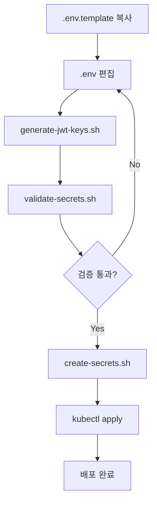

# Secret 생성 자동화 스크립트 가이드

이 디렉토리에는 Kubernetes Secret을 자동으로 생성하는 스크립트들이 있습니다.

---

## 📁 스크립트 목록

| 스크립트 | 설명 |
|---------|------|
| `generate-jwt-keys.sh` | JWT RSA 키 쌍 생성 |
| `create-secrets.sh` | Secret YAML 파일 생성 |
| `validate-secrets.sh` | 환경 변수 검증 |

---

## 🚀 빠른 시작

### 1단계: 환경 파일 준비

```bash
# 템플릿 복사
cp .env.template .env

# 환경 파일 편집 (실제 값 입력)
nano .env  # 또는 vim, code 등
```

**필수 입력 항목**:
- `MYSQL_PASSWORD`: MySQL 비밀번호
- `REDIS_PASSWORD`: Redis 비밀번호
- `GOOGLE_CLIENT_SECRET`: Google OAuth Secret
- `NAVER_CLIENT_SECRET`: Naver OAuth Secret
- `SMTP_USER`: Gmail 주소
- `SMTP_PASS`: Gmail 앱 비밀번호
- `YOUTUBE_API_KEY`: YouTube API 키
- `TWITTER_BEARER_TOKEN`: Twitter Bearer Token

### 2단계: JWT 키 생성

```bash
# JWT 키 생성
./scripts/generate-jwt-keys.sh

# 생성된 키 확인
ls -la jwt-keys/
```

**생성되는 파일**:
- `jwt-keys/access-private.key` - Access Token Private Key
- `jwt-keys/access-public.key` - Access Token Public Key
- `jwt-keys/refresh-private.key` - Refresh Token Private Key
- `jwt-keys/refresh-public.key` - Refresh Token Public Key

### 3단계: 환경 변수 검증

```bash
# 환경 변수가 모두 설정되었는지 확인
./scripts/validate-secrets.sh .env
```

**검증 항목**:
- 필수 변수 누락 확인
- 기본값('your-...') 사용 확인
- JWT 키 파일 존재 확인

### 4단계: Secret YAML 생성

```bash
# auth-server Secret 생성
./scripts/create-secrets.sh auth-server .env

# authz-server Secret 생성
./scripts/create-secrets.sh authz-server .env

# portal-server Secret 생성
./scripts/create-secrets.sh portal-server .env

# my-pick-server Secret 생성
./scripts/create-secrets.sh my-pick-server .env

# my-pick-client는 Secret이 필요하지 않음 (레거시 제거됨)
# ./scripts/create-secrets.sh my-pick-client .env
```

### 5단계: Secret 적용

```bash
# Dev 환경에 적용
kubectl apply -f applications/auth-server/secret.yaml -n krgeobuk-dev
kubectl apply -f applications/authz-server/secret.yaml -n krgeobuk-dev
kubectl apply -f applications/portal-server/secret.yaml -n krgeobuk-dev
kubectl apply -f applications/my-pick-server/secret.yaml -n krgeobuk-dev
# my-pick-client는 Secret이 필요하지 않음

# 적용 확인
kubectl get secrets -n krgeobuk-dev
```

---

## 📖 상세 사용법

### generate-jwt-keys.sh

JWT 인증에 사용할 RSA 키 쌍을 생성합니다.

**사용법**:
```bash
./scripts/generate-jwt-keys.sh
```

**옵션**:
- 기존 키가 있으면 덮어쓸지 물어봄
- 키 크기: 2048 bits (고정)

**출력**:
- `jwt-keys/` 디렉토리에 4개의 키 파일 생성
- 파일 권한 자동 설정 (600)

**주의사항**:
- ⚠️ Private Key는 auth-server만 보유
- ⚠️ Public Key는 다른 서비스와 공유
- ⚠️ jwt-keys/ 디렉토리는 .gitignore에 포함됨

---

### create-secrets.sh

환경 파일(.env)을 읽어서 Kubernetes Secret YAML을 생성합니다.

**사용법**:
```bash
./scripts/create-secrets.sh <service-name> <env-file>
```

**예시**:
```bash
# Dev 환경
./scripts/create-secrets.sh auth-server .env

# Prod 환경
./scripts/create-secrets.sh auth-server .env.prod
```

**지원 서비스**:
- `auth-server` - 인증 서버
- `authz-server` - 권한 서버
- `portal-server` - 포털 백엔드
- `my-pick-server` - MyPick 백엔드
- `my-pick-client` - MyPick 클라이언트 (현재 Secret 불필요)

**기능**:
- 환경 변수 Base64 인코딩
- JWT 키 자동 포함
- 기존 파일 자동 백업 (.backup.YYYYMMDD_HHMMSS)

---

### validate-secrets.sh

환경 파일의 필수 변수가 모두 설정되었는지 검증합니다.

**사용법**:
```bash
./scripts/validate-secrets.sh <env-file>
```

**예시**:
```bash
./scripts/validate-secrets.sh .env
./scripts/validate-secrets.sh .env.prod
```

**검증 내용**:
- ✅ 필수 변수 설정 여부
- ⚠️ 기본값('your-...') 사용 여부
- ✅ JWT 키 파일 존재 여부

**종료 코드**:
- `0` - 모든 검증 통과
- `1` - 검증 실패 (오류 수정 필요)

---

## 🔄 전체 워크플로우



### 단계별 명령어

```bash
# 1. 환경 파일 준비
cp .env.template .env
nano .env

# 2. JWT 키 생성
./scripts/generate-jwt-keys.sh

# 3. 검증
./scripts/validate-secrets.sh .env

# 4. Secret 생성 (모든 서비스)
for service in auth-server authz-server portal-server my-pick-server; do
    ./scripts/create-secrets.sh $service .env
done
# my-pick-client는 Secret이 필요하지 않음

# 5. Secret 적용 (Dev)
for service in auth-server authz-server portal-server my-pick-server; do
    kubectl apply -f applications/$service/secret.yaml -n krgeobuk-dev
done

# 6. 확인
kubectl get secrets -n krgeobuk-dev
```

---

## 🔐 보안 주의사항

### 파일 권한

```bash
# 환경 파일 권한 설정
chmod 600 .env .env.prod

# JWT 키 권한 설정 (스크립트가 자동 설정)
chmod 600 jwt-keys/*.key
```

### Git 커밋 금지

다음 파일들은 **절대로** Git에 커밋하지 마세요:
- ❌ `.env`, `.env.prod` (환경 파일)
- ❌ `jwt-keys/` (JWT 키 디렉토리)
- ❌ `**/secret.yaml` (생성된 Secret 파일)
- ✅ `.env.template` (템플릿만 커밋)
- ✅ `**/secret.yaml.template` (템플릿만 커밋)

**.gitignore 확인**:
```bash
grep -E "\.env|secret\.yaml|jwt-keys" .gitignore
```

---

## 🛠️ 트러블슈팅

### 문제 1: OpenSSL이 없음

**증상**:
```
오류: openssl이 설치되어 있지 않습니다.
```

**해결**:
```bash
# Ubuntu/Debian
sudo apt-get install openssl

# macOS
brew install openssl

# Windows
# Git Bash 또는 WSL 사용
```

### 문제 2: 환경 변수 누락

**증상**:
```
✗ MYSQL_PASSWORD: 미설정
```

**해결**:
```bash
# .env 파일 편집
nano .env

# 누락된 변수 추가
MYSQL_PASSWORD=your-actual-password
```

### 문제 3: JWT 키가 없음

**증상**:
```
✗ access-private.key: 없음
```

**해결**:
```bash
# JWT 키 생성
./scripts/generate-jwt-keys.sh
```

### 문제 4: Base64 인코딩 오류

**증상**:
```
base64: invalid option -- 'w'
```

**해결**:
```bash
# macOS에서는 -w 옵션이 없음
# 스크립트가 자동으로 처리하지만, 수동으로 할 경우:

# Linux
cat file.key | base64 -w 0

# macOS
cat file.key | base64
```

---

## 📚 추가 리소스

- [Phase 2 배포 체크리스트](../docs/phase2/PHASE2_CHECKLIST.md)
- [YouTube API 키 발급](https://console.cloud.google.com/)
- [Twitter API 키 발급](https://developer.twitter.com/)
- [Gmail 앱 비밀번호 생성](https://myaccount.google.com/apppasswords)

---

## 🎯 팁

### Prod 환경 별도 관리

```bash
# Prod용 환경 파일 생성
cp .env.template .env.prod
nano .env.prod  # Prod 값 입력

# Prod Secret 생성
./scripts/create-secrets.sh auth-server .env.prod

# Prod 적용
kubectl apply -f applications/auth-server/secret.yaml -n krgeobuk-prod
```

### 일괄 적용 스크립트

```bash
# deploy-secrets.sh 생성
cat > deploy-secrets.sh << 'EOF'
#!/bin/bash
NAMESPACE=${1:-krgeobuk-dev}
for service in auth-server authz-server portal-server my-pick-server; do
    echo "Applying $service secret to $NAMESPACE..."
    kubectl apply -f applications/$service/secret.yaml -n $NAMESPACE
done
# my-pick-client는 Secret이 필요하지 않음
EOF

chmod +x deploy-secrets.sh

# 사용
./deploy-secrets.sh krgeobuk-dev
./deploy-secrets.sh krgeobuk-prod
```

---

**작성자**: Claude Code
**버전**: 1.0.0
**마지막 업데이트**: 2024-12-23
